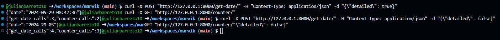

# marvik
Solución Segundo Punto Prueba Tecnica:

## Archivo python con el codigo de ejecucion del api:

* **main.py**

## Pasos a seguir:

* Se ejecuta el script *./ejecutar_scripts.sh* que dejar ecuchando el API en los dos end points creados 
1. http://127.0.0.1:8000/get-date/
2. http://127.0.0.1:8000/counter/

* Para probar el endpoint POST /get-date/, puedes usar curl o una herramienta como Postman. 
1. Ejemplo usando curl:

 '''
 curl -X POST "http://127.0.0.1:8000/get-date/" -H "Content-Type: application/json" -d "{\"detailed\": true}"
 '''

 '''
 curl -X GET "http://127.0.0.1:8000/counter/"
 '''

## Imagenes ejemplo ejecuciones en bash:

